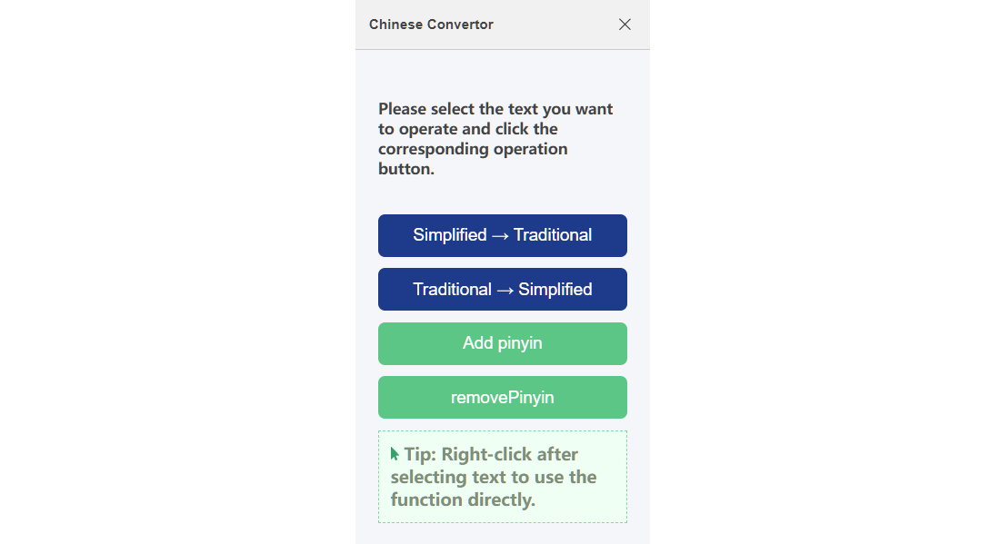
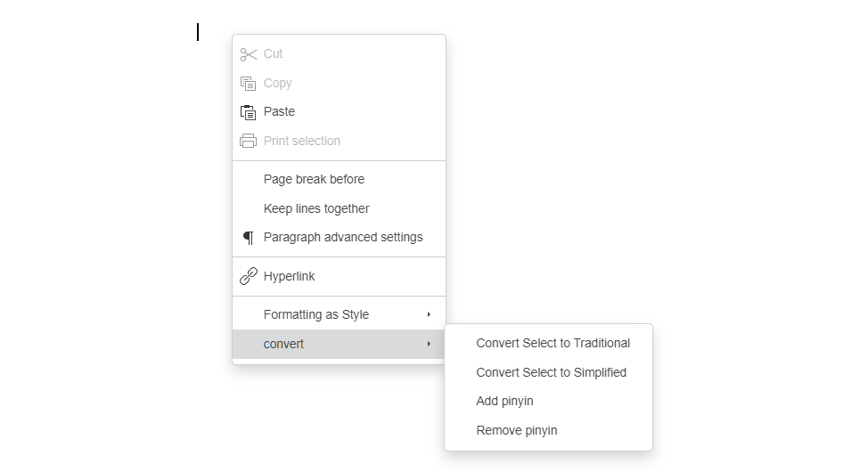

# Chinese Converter — Simplified ⇄ Traditional & Pinyin (ONLYOFFICE Plugin)

A lightweight and practical ONLYOFFICE plugin for Chinese text conversion. It enables instant conversion between Simplified and Traditional Chinese, and supports adding or removing Pinyin annotations — directly inside the editor.

> Current version: see `CHANGELOG.md`

---

## 🚀 Feature Overview

- **Simplified → Traditional**
  - Convert selected Simplified Chinese text to Traditional Chinese.

- **Traditional → Simplified**
  - Convert selected Traditional Chinese text to Simplified Chinese.

- **Add Pinyin**
  - Automatically generates Pinyin for each Chinese character in the selected text.
  - Pinyin is inserted inline immediately after each character in parentheses.
    - Example: 你好 → 你(nǐ)好(hǎo)
  - Useful for language learners, teaching materials, and pronunciation guidance.

- **Remove Pinyin**
  - Removes previously added inline Pinyin annotations (text inside parentheses).
  - Restores clean Chinese text formatting.

- **Right-Click Quick Access**
  - Access conversion features directly from the context menu after selecting text.

- **Multi-Editor Support**
  - Works in:
    - Document Editor
    - Spreadsheet Editor
    - PDF Editor

---

## 🖼️ UI Preview

📌 **Left Side Panel**  
_The main plugin interface displayed in the left window panel._  

📋 **Context Window (Right-Click Menu)**  
_Quick access to conversion actions directly from the context menu._  

---

## 🛠️ How to Use

1. Clone the repository and deploy it to an ONLYOFFICE environment that supports plugins.
2. Open a document, spreadsheet, or PDF file.
3. Select the Chinese text you want to modify.
4. Use one of the following methods:
   - Open **Chinese Converter** from the toolbar (left side panel).
   - Right-click the selected text and choose the desired action.
5. Choose one of the following actions:
   - `Simplified → Traditional`
   - `Traditional → Simplified`
   - `Add Pinyin`
   - `Remove Pinyin`

💡 Tip: You can also right-click after selecting text to access actions quickly.

---

## ✅ Supported Editors

- ✅ ONLYOFFICE Document Editor  
- ✅ ONLYOFFICE Spreadsheet Editor  
- ✅ ONLYOFFICE PDF Editor  
- ✅ Desktop Editors & Web Document Server  

---

## 💡 For Developers

- Built using the ONLYOFFICE plugin framework (`sdkjs-plugins`).
- Uses:
  - `Api.GetSelectedText()` for retrieving selected content.
  - `Api.ReplaceTextSmart()` for safe text replacement.
- Plugin configuration defined in `config.json`.
- Supports responsive side panel UI.

---

## 📦 Compatibility

- ✅ ONLYOFFICE Desktop Editors  
- ✅ ONLYOFFICE Document Server (Web)  
- ✅ Modern browser environments  

---

## 📜 License

Released under the [MIT License](LICENSE).

---

If you find this plugin helpful, please ⭐ Star, 🍴 Fork, and open Issues!